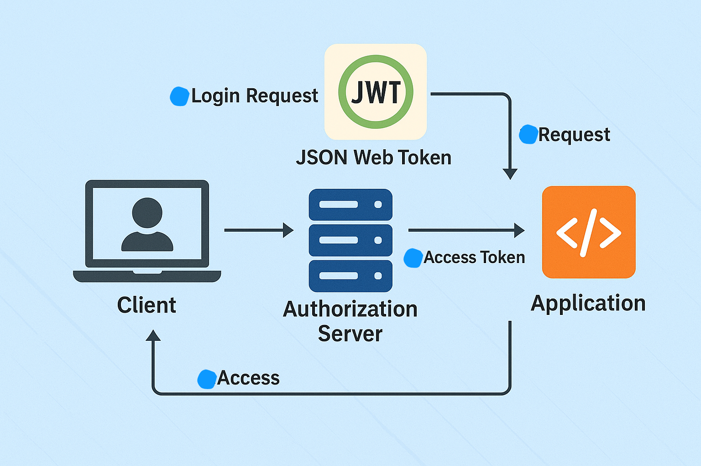
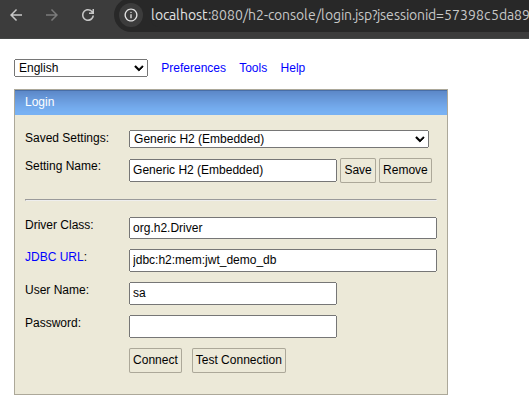
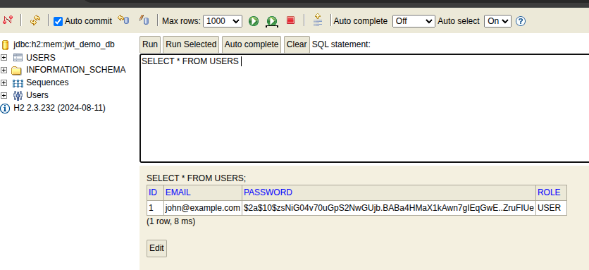

# 🔐 JWT Authentication using Spring Boot 3.3 + Java 21 + Swagger UI | Hindi Tutorial

This project demonstrates how to implement JWT (JSON Web Token) based login authentication using **Spring Boot 3.3**, **Java 21**, and **Spring Security 6.2**. It includes **Swagger UI integration** and an **H2 in-memory database** for demonstration and testing. 

---

## 📚 What is JWT?
JWT (JSON Web Token) is a secure, compact way to transmit claims between two parties. It's signed and optionally encrypted, often used for authentication.

Benefits:
* ✅ Stateless (no session needed)
* ✅ Compact & URL-safe
* ✅ Signed (cannot be tampered)

## 📺 YouTube Tutorial (Hindi)
🎯 Full Hindi video tutorial included with explanation and live coding.

**Watch here:** 
[](https://www.youtube.com/watch?v=7kCmIHl_Z0s)

---

## ✨ Features

- 🔐 JWT Token-based Authentication
- 🚫 No Session Storage (Stateless)
- 🧑‍💻 Login Endpoint: `/login`
- ✅ Token used to access secured APIs
- 📦 In-Memory H2 Database
- 🔎 Swagger UI with JWT support
- 📄 User model with `email` and `password`

---

## 🚀 Tech Stack

| Tech             | Version         |
|------------------|-----------------|
| Java             | 21              |
| Spring Boot      | 3.3.x           |
| Spring Security  | 6.2.x           |
| JWT              | 0.11.5          |
| Swagger UI       | 2.5.0 (Springdoc)|
| Database         | H2 (In-memory)  |
| Build Tool       | Gradle          |

---

## 📁 Project Structure
```
src/
├── config/
│ └── SwaggerConfig.java
│ └── DataInitializer.java
├── controller/
│ └── EmployeeController.java
├── dto/
│ ├── AuthRequest.java
│ └── AuthResponse.java
├── model/
│ └── User.java
├── repository/
│ └── UserRepository.java
├── security/
  ├── controller/AuthController
│ ├── JwtUtil.java
│ └── JwtFilter.java
├── service/
│ └── CustomUserDetailsService.java
├── resources/
│ ├── application.properties
└── Application.java
```


---

## 📦 Gradle Dependencies

```groovy
dependencies {
    implementation 'org.springframework.boot:spring-boot-starter-security'
    implementation 'org.springframework.boot:spring-boot-starter-web'
    implementation 'org.springframework.boot:spring-boot-starter-data-jpa'
    implementation 'com.h2database:h2'

    implementation 'io.jsonwebtoken:jjwt-api:0.11.5'
    runtimeOnly 'io.jsonwebtoken:jjwt-impl:0.11.5'
    runtimeOnly 'io.jsonwebtoken:jjwt-jackson:0.11.5'

    implementation 'org.springdoc:springdoc-openapi-starter-webmvc-ui:2.5.0'
}
```
## 🔐 API Endpoints
| Method | Endpoint   | Description            | Auth Required |
| ------ | ---------- | ---------------------- | ------------- |
| POST   | `/login`   | Generate JWT Token     | ❌ No          |
| GET    | `/welcome` | Secured API (Greeting) | ✅ Yes         |
| GET    | `/users`   | Fetch all users        | ✅ Yes         |

## 🧪 Default User (for testing)
```json
{
  "email": "john@example.com",
  "password": "password123"
}
```

## 📘 Swagger UI Setup
URL: http://localhost:8080/swagger-ui.html

1. Click on Authorize button.
2. Enter your token as:
```
Bearer <paste-your-token-here>
```
3. Now you can access secured APIs`json

## 🔄 JWT Authentication Flow
1. User sends email and password to /login.
2. Server validates credentials and returns JWT token.
3. Client stores token and adds it to Authorization header for future requests.
4. Server validates token on each request to secured endpoints.

## 🔽 JWT Architecture Diagram


## 🛠 How to Run
1. Clone the repository: 
```bash
git clone https://github.com/your-username/jwt-springboot-auth.git
cd jwt-springboot-auth
```
2. Run the app:
```bash
./gradlew bootRun 
```

## 🧰 H2 Database Console
URL: http://localhost:8080/h2-console
* JDBC URL: jdbc:h2:mem:testdb
* Username: sa
* Password: (leave blank)



